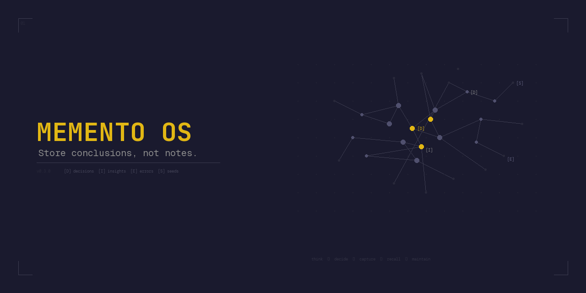

<p align="center">
  
</p>

<p align="center">
  <em>Unlike the guy in Memento, your AI actually remembers correctly — and knows when to forget.</em>
</p>

<p align="center">
  <a href="#install">Install</a> &middot;
  <a href="#how-it-works">How It Works</a> &middot;
  <a href="#the-atomic-unit">Reasoning Artifacts</a> &middot;
  <a href="#what-makes-this-different">What's Different</a> &middot;
  <a href="#evolution-log">Evolution</a>
</p>

---

**Memento OS** is a Claude Code plugin that gives your AI sessions persistent, validated memory. Every conclusion is stored as a reasoning artifact with an invalidation trigger — so your agent remembers what matters and knows when to re-evaluate.

```
/memento:init
```

Three questions. Thirty seconds. Your first decision captured.

---

## The Problem

AI coding agents are stateless by default. Every conversation starts from zero.

- Decisions discussed but never written down — **lost when the session ends**
- Context destroyed when the conversation gets too long — **compaction kills memory**
- Research done in one project — **invisible to every other project**
- "We decided to use Supabase" — **but nobody remembers why, or when that stops being true**

## Install

```bash
/plugin install memento-os
```

Then initialize your first project:

```bash
/memento:init
```

The init asks 3 questions:
1. **Where to store memory?** (auto-detects, confirm or change)
2. **What are you building?** (1-2 sentences)
3. **What's the hardest decision you've already made?** (becomes your first artifact)

Your memory folder is plain markdown. If you use Obsidian, point a vault at it for graph view and backlinks.

## How It Works

Five skills. One loop. Think → Decide → Capture → Recall → Maintain.

| Skill | What it does | When to use |
|-------|-------------|-------------|
| `/memento:grill-me` | **Think** — stress-test your plan through 6-dimension interrogation | Before committing to any design |
| `/memento:decide` | **Decide** — OODA loop that produces `[D]` artifacts or plants `[S]` seeds | When facing a choice between alternatives |
| `/memento:session-complete` | **Capture** — extracts all artifacts from the conversation | End of session or before compaction |
| `/memento:session-start` | **Recall** — loads context, surfaces active decisions, checks seeds | Start of every session |
| `/memento:vault-audit` | **Maintain** — health check, staleness scan, inbox processing | Periodically, when things feel messy |

Plus two commands:

| Command | What it does |
|---------|-------------|
| `/memento:init` | Set up memory for a project (3 questions, first artifact) |
| `/memento:stats` | Memory score, artifact breakdown, session streak |

Hooks run automatically — **Stop** captures artifacts when sessions end, **PreCompact** saves before context compression.

## The Atomic Unit

Everything in Memento OS is a **reasoning artifact** — a pre-computed conclusion with an expiration condition.

```
[D] Use Supabase over Firebase — invalidates if Firebase adds RLS [critical] [2026-03-21]
[I] Chrome MV3 service workers die after 30s — invalidates if Chrome changes policy [settled] [2026-03-01]
[E] Deployed without testing webhooks — root cause: no staging env [settled] [2026-03-05]
[S] Consider caching layer — activates when: API p95 > 200ms [settled] [2026-03-21]
```

Four types:

| Prefix | Type | Purpose |
|--------|------|---------|
| `[D]` | Decision | A choice between alternatives — has an invalidation trigger |
| `[I]` | Insight | A reusable conclusion — survives the session that produced it |
| `[E]` | Error | A mistake with root cause — defaults to settled, drops to noise once learning extracted |
| `[S]` | Seed | A forward-looking idea — **activates** when conditions are met, not when time passes |

### Priority Matrix

Every artifact gets a priority from confidence (Claude proposes) x impact (you confirm):

|  | High Impact | Low Impact |
|---|---|---|
| **High Confidence** | **critical** — pinned forever | **settled** — evict first |
| **Medium Confidence** | **volatile** — needs resolution | **settled** |
| **Low Confidence** | **volatile** | **noise** — evict or discard |

Cap: 24 artifacts per project. Eviction order: noise → settled → volatile → critical (never).

### Memory Score

Every session shows your memory health:

```
## Session Briefing — My Project
Memory: 7.2/10 | 18 artifacts | 3 seeds | streak: 5
```

Run `/memento:stats` for the full breakdown. Score is calculated from: artifact count, critical decisions, recency, staleness, seeds planted, and session streak.

## What Makes This Different

**1. Store conclusions, not notes.**
Most memory systems store conversation fragments, summaries, or raw context. Memento OS stores *reasoning outputs* — pre-computed conclusions that don't need re-reasoning. Your agent loads a decision, not a transcript.

**2. Seeds: ideas that surface when ready.**
`[S]` artifacts have activation triggers, not invalidation triggers. "Consider splitting this service — activates when: file count > 50." The vault pushes to you when conditions are met. You don't search — it finds you.

**3. Every artifact expires.**
No permanent notes. Every `[D]`, `[I]`, `[E]` has an invalidation trigger — a specific condition that would make it wrong. When that condition fires, the artifact gets re-evaluated. Memory that knows when to forget is more trustworthy than memory that doesn't.

## Works with Obsidian

Memento OS stores everything as plain markdown — which means [Obsidian](https://obsidian.md) users get graph view, backlinks, and search for free. No Obsidian required, but it's the best way to browse your memory visually.

### Setup

Point an Obsidian vault at your memory folder (created by `/memento:init`). That's it.

### Vault Structure

```
my-project/memento/
├── _context.md              # Active artifacts table (the brain)
├── NEXT.md                  # Session continuity (15 lines max)
├── Decisions/               # Full decision records (critical/volatile)
├── Sessions/                # Session log + archive
└── patterns/                # Cross-project reusable patterns (optional)
```

Folders are created on demand — `Decisions/` appears when your first critical artifact is recorded, not before.

### Tag System

Artifacts use nested tags for classification: `domain/subtopic`

```yaml
---
tags: [tech/architecture, ai/agents, product/auth]
type: decision          # or: research, insight, note, project-context
status: active          # or: draft, archived, superseded
confidence: high        # or: medium, low
---
```

Common tag domains: `tech/`, `business/`, `product/`, `ai/`, `personal/`

Keep it focused — 3-7 tags per document. Project identity goes in the `project:` field, not tags.

### Obsidian Graph View

With wikilinks and tags, your decisions form a visible knowledge graph:
- **Artifacts link to each other** via `[[wikilinks]]` in the `## Related` section
- **Cross-project patterns** surface in `patterns/` and link back to origin projects
- **MOC (Map of Content) hubs** connect project silos — e.g., `[[MOC — AI & Agents]]`
- **Tag-based filtering** lets you see all `tech/architecture` decisions across every project

### Knowledge Location Rules

| Content | Where | Why |
|---------|-------|-----|
| Active decisions & artifacts | `_context.md` | Fast LLM access — loaded every session |
| Full decision records | `Decisions/` | Detailed rationale with alternatives considered |
| Session history | `Sessions/SESSION_LOG.md` | What happened, when, what was produced |
| Reusable patterns | `patterns/` | Cross-project insights that save time |
| Research & deep dives | `Research/` (optional) | Competitive intel, market analysis |

**Rule:** Never duplicate. If a doc exists in a repo, the vault has a pointer, not a copy.

## Before / After

**Without Memento OS** (session 5):
```
> What auth approach did we decide on?
I don't have context on previous decisions. Could you remind me
what was discussed?
```

**With Memento OS** (session 5):
```
## Session Briefing — My Project
Memory: 6.8/10 | 14 artifacts | 2 seeds | streak: 5

### Active Decisions
[D] OAuth via Supabase Auth — invalidates if rate limits hit [critical]
[D] Mobile-first, no desktop v1 — invalidates if desktop demand >30% [critical]

### Seeds Ready
[S] Consider Redis caching — activates when: API p95 > 200ms ← CONDITION MET
```

## Why I Built This

Memento OS started as a personal knowledge base. Like most developers, I reached for Obsidian, created a vault, and started dumping everything into it — notes, context, research, raw captures. The usual approach.

Then I started using Claude Code across multiple projects, feeding it context from the vault. It worked — until I noticed a pattern that kept bothering me: Claude and I would reach the same conclusion two or three times across different sessions. Sometimes the wording changed slightly. Sometimes the reasoning took a different path. But the conclusion was the same one we'd already made.

The problem wasn't that the AI forgot. The problem was that I was saving the wrong things. The vault was full of notes, but the actual decisions — the conclusions that mattered — were buried in noise. I had plenty of context but no memory.

So I flipped the approach. Instead of capturing everything and hoping the important parts surface, I started capturing *only* the conclusions: decisions made, insights discovered, errors understood. Each one with a specific condition that would make it invalid — so the system knows when to question itself instead of blindly trusting old conclusions.

That change — from "save everything" to "save only conclusions" — turned out to be the entire product. The skills, the hooks, the seeds, the priority matrix — all of it flows from that one shift.

### The Vault-Beside-Code Architecture

The vault works best when it sits alongside your project folders — same parent directory, like `~/Documents/Developer/`:

```
~/Documents/Developer/
├── knowledge-vault/          # Your memory vault (Obsidian optional)
│   ├── Projects/my-app/      # Memory for my-app
│   ├── Projects/other-app/   # Memory for other-app
│   └── Knowledge/patterns/   # Cross-project patterns
├── my-app/                   # Actual codebase
├── other-app/                # Another codebase
└── ...
```

This way, when you're working in any project, the vault has direct access to every codebase — and every project session can pull context from the shared vault. Cross-project patterns surface naturally because the vault sees everything.

This is how I use it, but it's not required. You can put the vault anywhere — Dropbox, a separate folder, wherever makes sense. One note: iCloud sync can cause issues with Obsidian reading vault files. If you hit that, the workaround is keeping the vault local and using Obsidian Sync for mobile access. If anyone has found a better solution for iCloud, I'm open to suggestions.

### Building in Public

This repo documents the journey — not just the finished product. The [evolution log](#evolution-log) is a series of case studies: problems I hit, approaches I tried, what actually worked. Some entries are solved, some are in progress, some are upcoming problems I know are coming but haven't fixed yet.

The self-evaluation score (currently 7.8/10) is honest. I haven't had anyone else try this yet. If something breaks for you, that's the most valuable feedback I can get.

## Evolution Log

How we got here — failure by failure, fix by fix.

<details>
<summary>Click to expand</summary>

| # | Problem | Status | Score Impact |
|---|---------|--------|-------------|
| [001](evolution/001-tiered-context.md) | Tiered Context Loading | Solved | Token efficiency 4→8 |
| [002](evolution/002-safety-hooks.md) | Safety Hooks | Solved | Auto-capture 3→5 |
| [003](evolution/003-vault-bridge.md) | Vault Bridge | Solved | Knowledge OS fit 6→9 |
| [004](evolution/004-cross-project-linking.md) | Cross-Project Linking | Solved | Cross-file linking 3→7 |
| [005](evolution/005-scattered-captures.md) | Scattered Captures | In Progress | TBD |
| [006](evolution/006-decision-rot.md) | Decision Rot | Upcoming | Target 7 |
| [007](evolution/007-compaction-loss.md) | Compaction Loss | Upcoming | Target 7 |
| [008](evolution/008-write-discipline.md) | Write Discipline | Upcoming | Target 8 |

</details>

## Who This Is For

- **Claude Code users** who want persistent memory without building their own system
- **Solo developers** tired of re-explaining decisions to their AI every session
- **Anyone building with AI agents** who wants conclusions that survive compaction

**Not for:** Teams wanting Jira integration. Non-CLI workflows (yet). People who think more context = better (it doesn't).

## Self-Evaluation

Current system score: **7.8 / 10** — core engine is strong, onboarding designed, documentation shipped.

Score your own memory system: [system/scorecard.md](system/scorecard.md)

## Contributing

Contributions welcome:
- Evolution entries from your own memory system experiences
- Starter configs for non-Claude-Code tools (Cursor, Windsurf, Copilot)
- Scorecard improvements
- Translations

Not accepted: vendor-specific plugins, paid tool integrations, AI-generated filler.

## License

[MIT](LICENSE)
