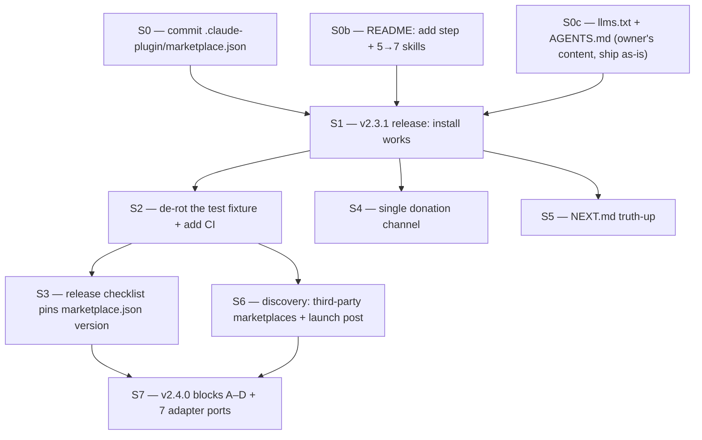

# Spec: v2.3.1 — Install Integrity

Written 2026-09-05, `--from-context`. Supersedes nothing; it is the release that has to land
before `docs/specs/2026-05-20-v2.4-knowledge-os-feature-port.md` is worth building.

## Problem Statement

**Memento OS cannot be installed by any documented path, and has not been able to since it
started calling itself a plugin.**

The chain a user follows is `marketplace.json` on GitHub → `/plugin marketplace add` →
`/plugin install`. Link one is missing:

| Fact | Evidence (verified 2026-09-05) |
|---|---|
| `.claude-plugin/marketplace.json` is **untracked** | `git status` → `?? .claude-plugin/marketplace.json`; `git ls-files .claude-plugin/` returns only `plugin.json` |
| GitHub does not serve it | `gh api repos/Aiyo28/memento-os/contents/.claude-plugin/marketplace.json` → **404** |
| The published README omits the add step entirely | published `README.md:31` = `/plugin install memento-os`, no `marketplace add` |

So the currently published instruction fails, and the fix sitting uncommitted in the working
tree — which correctly adds `/plugin marketplace add Aiyo28/memento-os` — **would also fail**,
because the manifest it points at is not on GitHub. Shipping that README change alone makes the
failure worse, not better: today the user fails at a command they can see is unsupported;
afterwards they fail at a command they were explicitly told to run.

Two smaller integrity defects ride along:

- **Skill count is wrong in the published README and in the working-tree README.** v2.3.0 ships
  7 skills (`ls skills` → `decide grill-me memento-decay memento-lint session-complete
  session-start vault-audit`). Published `README.md:94` says "5 skills"; the working-tree
  README at line 95 **still says "5 skills"** — the owner's uncommitted edit fixed the install
  step but not the count. `llms.txt` was fixed (local line 46 says `Skills (7)`), so README and
  `llms.txt` now disagree with each other as well as with reality.
- **Two donation channels point different places.** `.github/FUNDING.yml` is `ko_fi: aiyo1939`
  (committed, live, renders the Sponsor button) while the README body still carries the PayPal
  badge. Path B requires *a* donation CTA; it currently has two.

## Solution

One release, `v2.3.1`, whose only job is that the documented install works and the repo does not
lie about what it ships. No features.

For the user: `/plugin marketplace add Aiyo28/memento-os` → `/plugin install memento-os`
succeeds, and the plugin they get advertises the 7 skills it actually contains.

**S0, S0b and S0c are one atomic commit.** Splitting them ships a README that documents a 404.

## Glossary (Ubiquitous Language)

No `docs/GLOSSARY.md` exists in this repo. These are the terms this spec uses; they are extracted
from existing repo vocabulary, not invented here.

| Term | Definition | Aliases to avoid |
|------|------------|------------------|
| plugin manifest | `.claude-plugin/plugin.json` — describes the plugin itself | "plugin config" |
| marketplace manifest | `.claude-plugin/marketplace.json` — the catalogue entry `/plugin marketplace add` reads | "marketplace file", "registry" |
| skill | a directory under `skills/` invoked as `/memento:<name>` | "command" (that is `commands/`), "verb" |
| adapter | a per-host port under `adapters/<host>/` | "integration", "bridge" |
| artifact | a `[D]` `[I]` `[E]` `[S]` reasoning record | "note", "memory", "entry" |
| install chain | marketplace manifest on GitHub → `marketplace add` → `plugin install` | "install flow" |

Naming note: skill **directories** and skill **invocation names** differ
(`skills/memento-decay/` → `/memento:decay`). The working-tree `llms.txt` already documents this
trap; keep that wording as the canonical statement.

## User Stories

1. As a developer who found the repo, I want `/plugin marketplace add Aiyo28/memento-os` to
   succeed, so that the next command in the README is runnable.
2. As that developer, I want `/plugin install memento-os` to install the plugin, so that I get
   the skills without cloning anything.
3. As that developer, I want the README's component list to match what installs, so that I do not
   go looking for `/memento:lint` believing it does not exist.
4. As a reader of `llms.txt`, I want the skill list to match the README, so that an assistant
   reading one does not contradict a human reading the other.
5. As someone who wants to fund the project, I want one donation destination, so that I do not
   have to guess which of two is current.
6. As the maintainer, I want `tests/run.sh` to be green, so that "the suite passes" is a claim I
   can make when tagging.
7. As the maintainer, I want the suite to run on every push, so that it cannot go red unnoticed
   for three months again.
8. As a future session, I want `NEXT.md` to describe work that is actually outstanding, so that I
   do not re-do six finished items.

## Implementation Decisions

### Module: marketplace manifest (S0)

Interface: one JSON file, `.claude-plugin/marketplace.json`, consumed by Claude Code's
`/plugin marketplace add`.

The file already exists on disk and is well-formed. The only change is that it becomes tracked.
Its `version` field currently reads `2.3.0` and must be bumped in lockstep with `plugin.json`
(see S3) — it is a second place the version lives, which is why S3 exists at all.

`plugin.json` is already committed and served by GitHub (sha `0a9e9db`), so it needs no change
for this release beyond the version bump.

### Module: README install section (S0b)

Two edits, both in the working tree already or adjacent to it:

- The `marketplace add` step — **already written by the owner**, lines 31 and 95. Ship unchanged.
- `5 skills` → `7 skills` at line 95, plus the Codex row at line 97 which repeats "5 skills".
  **Not yet done in the working tree.** This is the one place this release adds to the owner's
  diff rather than shipping it as-is.

### Module: test fixture time-independence (S2)

Root cause, verified: `tests/fixtures/decay/_context.md` row 4 is hardcoded `2026-05-15` and
`tests/run.sh:90` asserts `[D]#4` is *absent* from `--age 30` output, labelled "5 days old". That
was true on 2026-05-20. On 2026-09-05 the artifact is 113 days old, decay correctly surfaces it,
and the assertion fails. **`decay.py` is not broken — the fixture is.**

The suite has been red since roughly 2026-06-14, when `#4` crossed the 30-day window. Nothing
noticed because there is no CI.

Interface decision: the fixture must express age *relative to run time*. Two candidate shapes —

| Option | Shape | Trade-off |
|---|---|---|
| **A (preferred)** | `tests/run.sh` generates the decay fixture into a temp dir, computing dates as `today - N days` | Fixture becomes data the test owns; no production-code change; the "5 days old" label becomes true forever |
| B | `decay.py` accepts `--today YYYY-MM-DD` for testability | Cleaner assertions, but adds a production flag that exists only for tests |

Take A. It keeps the test-only concern inside the test harness, which matches the repo's existing
"no external test framework, bash + fixtures" stance stated in `tests/README.md`.

### Module: CI (S2)

A single GitHub Actions workflow running `./tests/run.sh` on push and PR to `main`. Python 3 is
the only dependency (`lint.py`, `decay.py`); no package install step is required.

The workflow must run the suite **after** S2's fixture fix, not before — adding CI to a red suite
ships a red badge.

### Module: donation channel (S4)

`.github/FUNDING.yml` is the machine-readable source and is already Ko-fi. Resolve toward it:
replace the README's PayPal badge and link with Ko-fi. Do not delete the CTA — Path B requires
one. Check `llms.txt` and the adapter READMEs for further PayPal references before declaring it
done.

### Module: release checklist (S3)

The version now lives in three places — `plugin.json`, `marketplace.json`, `CHANGELOG.md` — plus
the git tag. `RELEASE.md` exists; extend it with a checklist that names all of them, so the next
release does not push a `marketplace.json` still advertising the previous version.

## Testing Decisions

- **The fixture fix is itself the test.** After S2, `./tests/run.sh` must exit 0 on any date. The
  cheap proof: run it, then re-run with the system clock's date arithmetic pushed forward in the
  generator (e.g. generate the fixture as `today - 400 days` and assert `#4` now *does* surface).
  That inverts the assertion and proves the fixture is genuinely relative rather than
  accidentally passing.
- **Do not add tests for the install chain.** It is not testable in CI without a Claude Code
  runtime. It is verified once, by hand, by running the two documented commands on a clean
  machine after S1 pushes. Record the result in `NEXT.md`.
- Prior art: `tests/run.sh` asserts on exit codes and key substrings rather than golden output,
  precisely because "decay scores depend on today's date" (`tests/README.md`). The rotting
  fixture is that same awareness applied incompletely — the harness avoided golden output but
  left absolute dates in the data.
- Current state, verified this session: **36 passed, 1 failed, exit 1.** `NEXT.md`'s claim of
  "37/37 assertions pass" is stale.

## Out of Scope

- **All four v2.4 blocks.** They are the next release, not this one; see the plan document.
- Any change to `decay.py` or `lint.py` behaviour. S2 touches fixtures and the harness only.
- Adapter re-porting. No adapter content changes in v2.3.1.
- Third-party marketplace submissions and the launch post — sequenced at S6, after the install
  chain provably works.
- `AGENTS.md`'s restructure into an Operator Letter. It ships as the owner wrote it; this spec
  makes no judgement on its content.

## Non-Goals

Generic checklist: `_shared/non-goals.md`. Task-specific:

| # | Looks like success | Actually means |
|---|---|---|
| 1 | The README now shows `/plugin marketplace add` | The command still 404s, because `marketplace.json` was not committed in the same push. The README change alone is a regression |
| 2 | `tests/run.sh` exits 0 today | The fixture was edited to a newer absolute date. It will rot again on a known schedule — this is the same bug with a later fuse |
| 3 | CI is added and the badge is green | CI runs on a branch that is not `main`, or the workflow's trigger never fires, so nothing is actually gated |
| 4 | Version bumped in `plugin.json` | `marketplace.json` still advertises the old version, so `/plugin install` fetches a stale entry |
| 5 | "Install is fixed" | Nobody ran the two commands on a clean machine. The chain is only provably fixed by executing it once, end to end |
| 6 | The skill count says 7 | It says 7 in the README but the Codex adapter row and `llms.txt` disagree, so the repo still contradicts itself |

## Further Notes

**Risk this release exists to remove.** The v2.4 spec's own maturity table records that blocks
A, C and D are *spec-only in Knowledge OS* — never implemented anywhere. v2.4 would therefore
be memento-os implementing three unproven designs, plus porting them across 7 adapters. Doing
that on top of an install chain that does not work means the first feedback on unproven
architecture arrives from nobody, because nobody can install it.

**Open question for the owner (not blocking):** `marketplace.json` currently declares a
marketplace containing exactly one plugin, hosted inside that same plugin's repo. That works, but
it is why discovery is nil — there is nothing to browse. Whether memento-os should also be
submitted to community marketplaces is an S6 decision, deliberately deferred until the chain
works.
